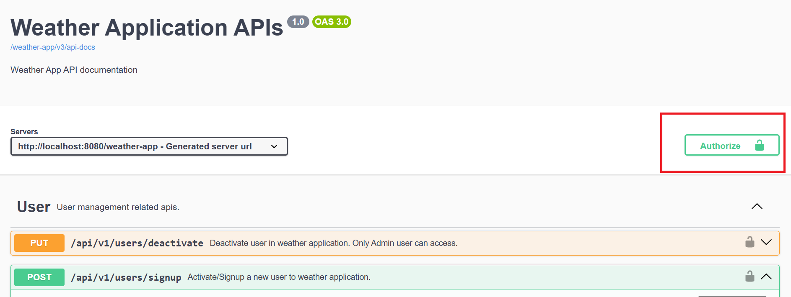
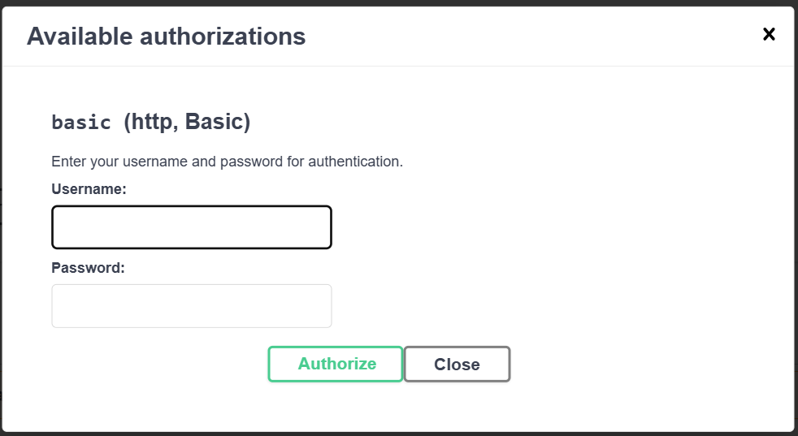

# Steps to test the API functionality.

1. First register yourself at [Signup API ](http://localhost:8080/weather-app/swagger-ui/index.html#/User/signupUser)
   with unique userName and strong password as per password policy mentioned above in [README.MD](../README.md).
2. Any unauthenticated access of API will give 401: Unauthorized error. So you first authenticate yourself.
3. Login/Authorize yourself by entering newly created username and password in **Authorize** button on a top right
   corner of swagger UI. Refer to the screenshot below:
   
   Enter your username and password in the text box provided and click on Authorize button, as shown in below screen.
   
4. Now Apis are ready to use. 